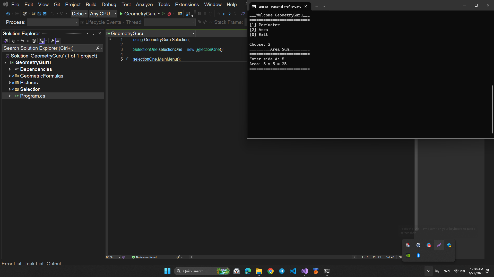
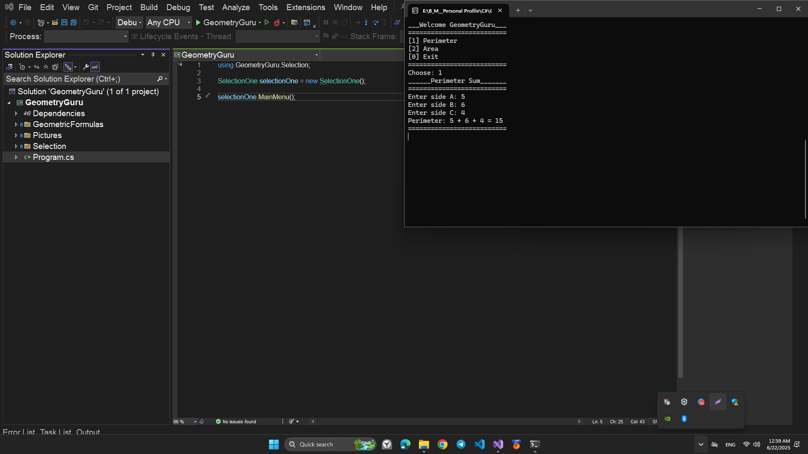
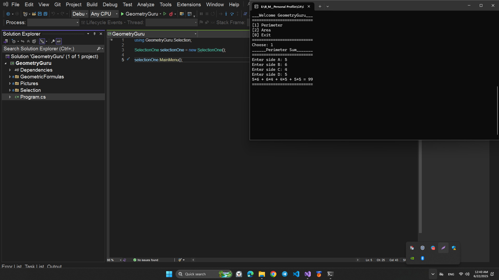

# Weekly Assignment GeometryGuru

## 📐 GeometryGuru

**GeometryGuru** — bu C# dasturlash tilida yozilgan konsol ilovasi bo‘lib, turli geometrik shakllarning yuzasi va perimetrini hisoblashga yordam beradi. Dasturni ishga tushurganingizdan so`ng tanlovlar orqali natijalarni olishingiz mumkin. Agar Menyudagi tanlovlardan xato tanlov qilsangiz qayta kiritishingiz mumkin.

## ✨ Xususiyatlari

- To‘g‘ri to‘rtburchak (Rectangle)
- Kvadrat (Square)
- To‘g‘ri burchakli uchburchak (Right Triangle)
- Trapetsiya (Trapezoid)
- Parallelogramma (Parallelogram)

## 📁 Fayllar tuzilmasi

- `Program.cs` — Asosiy ishga tushirish fayli
- `Selection/MainMenu.cs` — Foydalanuvchi interfeysi va tanlovlar
- `Selection/SubMenu.cs` — Ichki tanlov va hisoblash funksiyalari
- `GeometryGuru.csproj`, `GeometryGuru.sln` — Visual Studio loyihasi fayllari
- `GeometricFormulas` Geometrik formulalar classlari

## 🚀 Ishga tushirish

1. Visual Studio oching
2. `GeometryGuru.sln` faylini yuklang
3. `Program.cs` ni ishga tushiring (`Ctrl+F5`)

## 🧮 Konsol Menyusi

```
___Welcome GeometryGuru___
==========================
[1] Rectangle
[2] Square
[3] RightTriangle
[4] Trapezoid
[5] Parallelogram
[0] Exit
==========================
Choose:
```

## ⚙️ Talablar

- .NET Framework 4.7.2 yoki undan yuqorisi
- Visual Studio 2019 yoki yangi

## 📄 Litsenziya

- Ochiq manba. Istalgan loyihada foydalanishingiz mumkin.

## 📸 Dastur operatsiyasidan rasmlar

## To‘g‘ri to‘rtburchak `(Rectangle)`


## Kvadrat `(Square)`




## To‘g‘ri burchakli uchburchak `(Right Triangle)`




## Trapetsiya `(Trapezoid)`




## Parallelogramma `(Parallelogram)`


